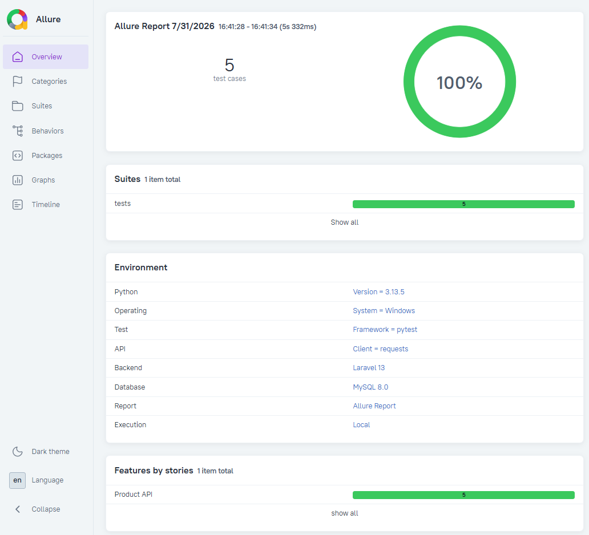
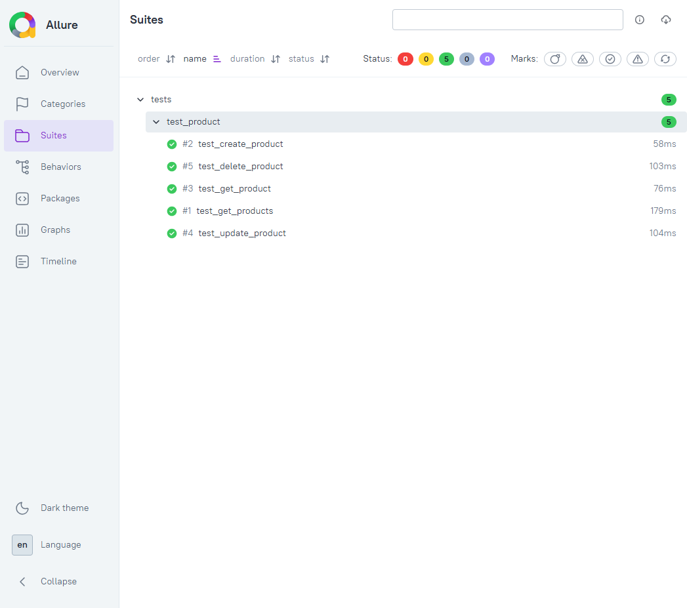
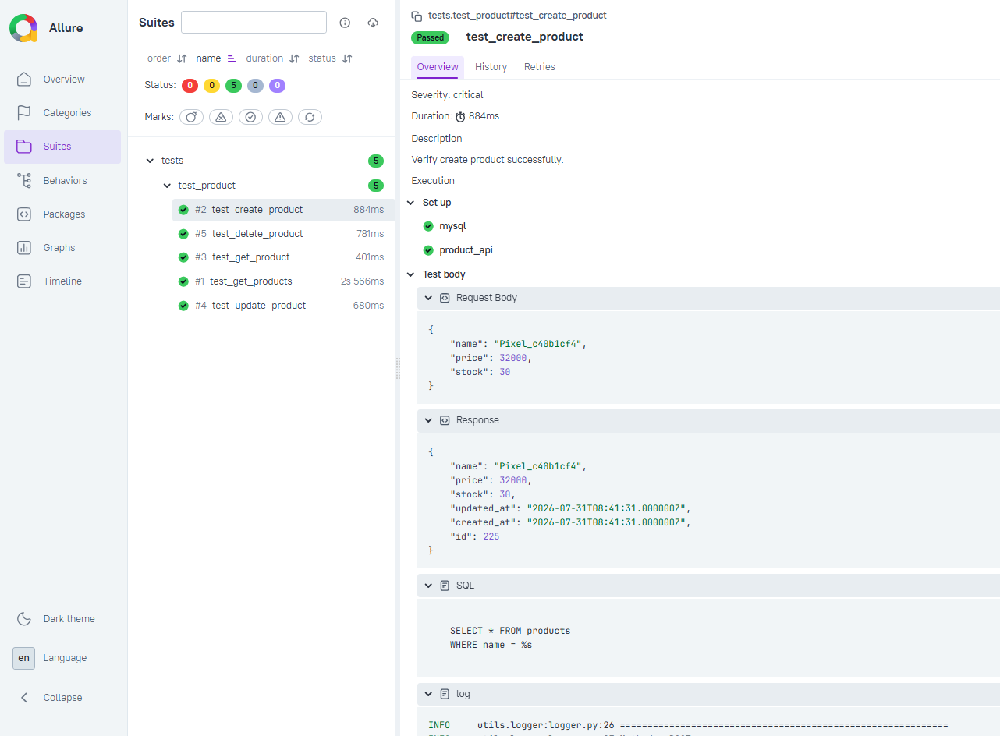

# Python API Automation


An API automation testing project built with **Python**, **Pytest**, **Requests**, **Laravel API**, **GitHub Actions**, and **Allure Report**.

## Features

- API Automation with Python Requests
- Pytest-based Test Framework
- Laravel RESTful API Testing
- GitHub Actions CI
- Allure Test Report

## Test Coverage

- Product CRUD APIs
- Database Validation
- API Response Validation
- Status Code Validation

## How to Run

```bash
pip install -r requirements.txt
pytest
```

## Continuous Integration

This project uses **GitHub Actions** to:

- Execute API automated tests
- Generate Allure HTML Report
- Upload Allure Results as workflow artifacts
- Upload Laravel server log
- Upload Laravel error logs on failure

## Artifacts

The following artifacts are generated after each workflow run:

- Allure HTML Report
- Allure Results
- Laravel Server Log
- Laravel Error Log (Failure Only)

These artifacts are uploaded as GitHub Actions workflow artifacts.

## Test Report

### Allure Report Overview

All 5 API test cases passed successfully.



### API Test Suites

The test suite covers product CRUD operations, including query, creation,
update, and deletion scenarios.



### Test Case Detail

The detailed result includes the request body, API response, SQL query,
execution log, and database validation information.

